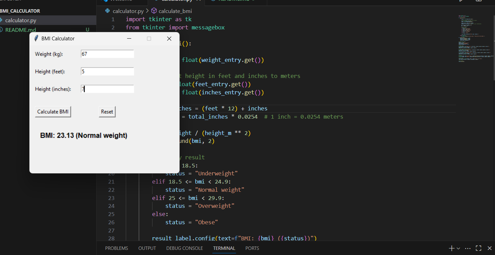

# BMI Calculator with Tkinter

A simple Python GUI application that calculates Body Mass Index (BMI) based on the user's weight and height.

## 📌 Features
- Enter weight in **kg**
- Enter height in **feet** and **inches**
- Calculates BMI and shows the category:
  - Underweight
  - Normal weight
  - Overweight
  - Obese
- **Reset** button to clear inputs
- User-friendly Tkinter interface

## 🖥️ Requirements
- Python 3.x
- Tkinter (comes pre-installed with Python)

## 🚀 How to Run
1. Clone this repository:
   ```bash
   git clone https://github.com/Seja-git/BMI-Calculator.git

## 📷 Screenshot

Here’s how the BMI Calculator looks:



